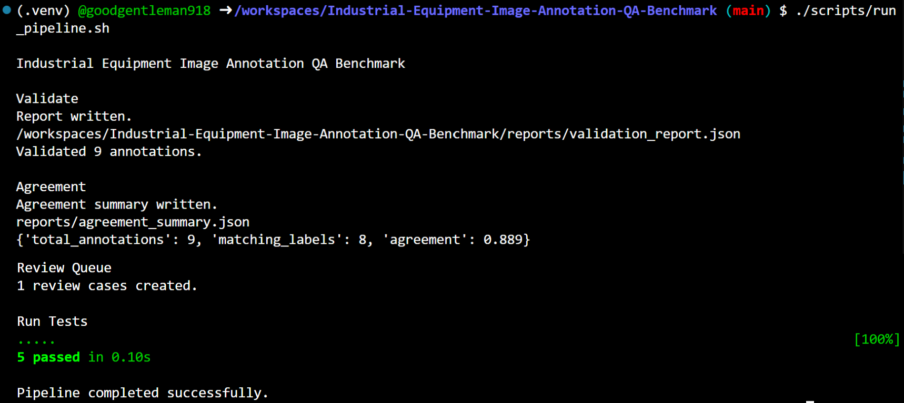
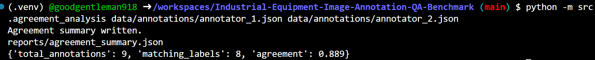
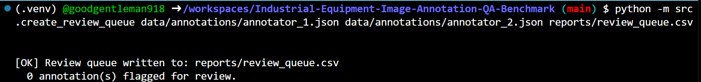
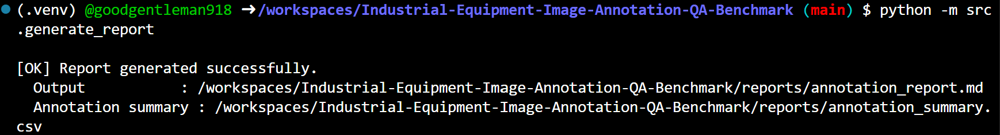
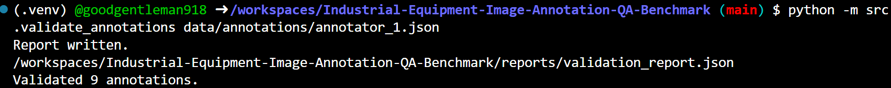
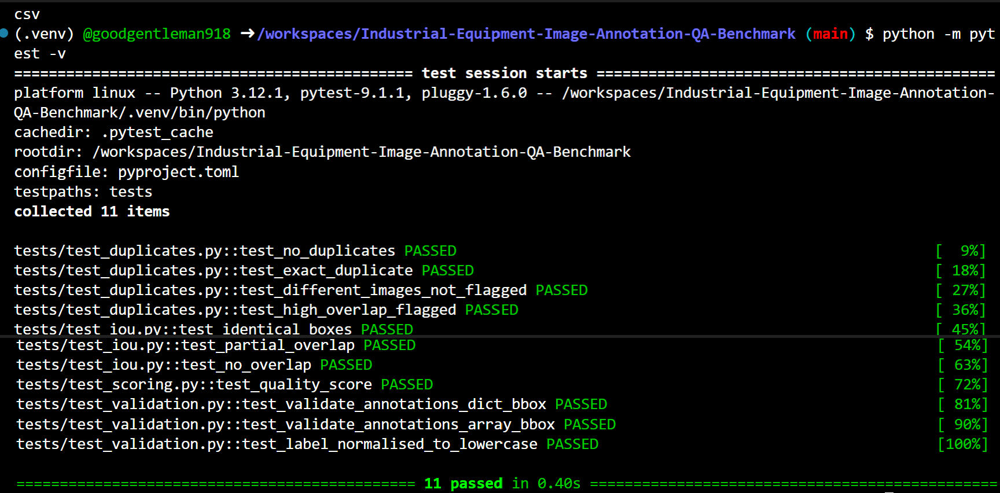

# Industrial Equipment Image Annotation QA Benchmark

A complete, production-style **Image Annotation Quality Assurance** pipeline for industrial equipment datasets.

This repository simulates a real-world annotation review workflow used by AI data companies — validating annotations against actual image files, measuring inter-annotator agreement, detecting duplicates, and generating structured QA reports.

---

## Project Objectives

This benchmark demonstrates:

- **Real image validation** — resolves annotation filenames to actual uploaded files, loads true dimensions using Pillow, validates bounding boxes fit within actual image bounds
- **Schema validation** — enforces annotation structure via Pydantic (handles array and dict bbox formats, extra fields, mixed-case labels)
- **Class validation** — checks labels against a defined list of valid equipment classes
- **Duplicate detection** — IoU-based bounding box duplicate detection across annotators
- **Inter-annotator agreement** — label match rate + spatial IoU agreement with per-label breakdown
- **Review queue generation** — flags annotations with label disagreements, low IoU, or low confidence
- **Quality scoring** — configurable pass/fail thresholds
- **Consolidated reporting** — Markdown report + CSV summary with per-image real dimensions and bbox status

---

## Repository Structure

```
Industrial-Equipment-Image-Annotation-QA-Benchmark/
├── data/
│   ├── annotations/
│   │   ├── annotator_1.json        ← Annotator 1 bounding box data
│   │   ├── annotator_2.json        ← Annotator 2 bounding box data
│   │   └── ground_truth.json       ← Ground truth reference
│   ├── images/                     ← Upload your 9 equipment images here (required)
│   └── images.csv                  ← Image metadata (updated to match actual filenames)
├── reports/                        ← Auto-generated pipeline outputs
│   ├── validation_report.json      ← Schema + class + image validation results
│   ├── agreement_summary.json      ← Inter-annotator label + IoU agreement
│   ├── annotation_report.md        ← Consolidated Markdown QA report
│   ├── annotation_summary.csv      ← Per-image: real dims, bbox status, labels
│   ├── duplicate_boxes.csv         ← Near-duplicate bounding box pairs
│   └── review_queue.csv            ← Annotations flagged for manual review
├── rubrics/
│   └── annotation_rubric.json
├── scripts/
│   ├── run_pipeline.ps1            ← Main pipeline (auto-detects Python venv)
│   └── run_pipeline.sh
├── src/
│   ├── validate_annotations.py     ← 4-stage validation: schema, class, image, bbox bounds
│   ├── image_validator.py          ← Fuzzy image resolver + real dimension loader (Pillow)
│   ├── calculate_iou.py            ← IoU calculation
│   ├── duplicate_detection.py      ← IoU-based duplicate detection
│   ├── agreement_analysis.py       ← Inter-annotator agreement + per-label breakdown
│   ├── quality_scoring.py          ← Configurable quality scoring
│   ├── create_review_queue.py      ← Flag low-IoU / low-confidence / disagreeing annotations
│   ├── generate_report.py          ← Markdown report + annotation_summary.csv with real dims
│   ├── schemas.py                  ← Pydantic models (handles array bbox, extra fields)
│   └── config.py                   ← Thresholds, valid classes, paths
├── tests/
│   ├── test_iou.py
│   ├── test_scoring.py
│   ├── test_validation.py
│   └── test_duplicates.py
├── conftest.py                     ← Adds project root to sys.path for pytest
├── run.ps1                         ← Top-level launcher (run from anywhere, bypasses policy)
├── .gitignore
├── LICENSE
├── README.md
├── pyproject.toml
└── requirements.txt
```

---

## Technologies

| Library | Purpose |
|---------|---------|
| Python 3.12 | Core language |
| Pydantic ≥ 2.8 | Annotation schema validation |
| Pillow ≥ 10.0 | Loading real image dimensions |
| OpenCV ≥ 4.8 | Image processing utilities |
| Pandas | CSV generation and analysis |
| NumPy | IoU calculations |
| Pytest ≥ 8.0 | Unit testing (11 tests) |

---

## MANDATORY: Upload Your Images First

> **This pipeline will NOT run without images.**
>
> A pre-flight check runs before every pipeline execution.
> If `data/images/` contains no image files, the pipeline exits immediately with a clear error.

Upload **9 industrial equipment images** (JPG / JPEG / PNG) to `data/images/` before running.

**Naming convention** — the pipeline uses fuzzy filename matching, so exact names are flexible.
The images used during development (referenced in `images.csv`) were:

```
data/images/pump_001.png
data/images/valve_001.jpg
data/images/motor_001.jpg
data/images/bearing_001.jpg
data/images/pipeline_001.jpg
data/images/gearbox_001.jpg
data/images/air_compressor_001.png
data/images/heat_exchanger_001.jpg
data/images/electrical_panel_001.jpg
```

The pipeline automatically resolves annotation image references (e.g. `pump.jpg`) to actual files
(e.g. `pump_001.png`) — handling suffix differences and extension mismatches.

Images are **not gitignored** — every user must upload their own equipment images.

---

## How the Pipeline Uses Your Images

Once images are uploaded, the pipeline does the following with them on every run:

1. **Pre-flight check** — counts `.jpg / .jpeg / .png` files; exits if none found
2. **Filename resolution** — fuzzy-matches annotation references to actual files (e.g. `pump.jpg` → `pump_001.png`)
3. **Real dimension loading** — opens each image with Pillow and reads actual `width × height`
4. **BBox bounds validation** — for every annotation, checks `x + w ≤ real_width` and `y + h ≤ real_height`
5. **Per-image report** — `annotation_summary.csv` shows resolved filename, real dimensions, and bbox status for each annotation

---

## Local Setup & Execution

### 1. Clone the repository

```powershell
git clone https://github.com/Enterprise-AI-Soutions/Industrial-Equipment-Image-Annotation-QA-Benchmark.git
cd Industrial-Equipment-Image-Annotation-QA-Benchmark
```

### 2. Upload your 9 equipment images

Copy your images into `data/images/` before proceeding.

### 3. Create virtual environment & install dependencies

```powershell
# PowerShell
py -3.12 -m venv .venv
.\.venv\Scripts\Activate
python -m pip install --upgrade pip
python -m pip install -r requirements.txt
```
```
Install Vscode dependencies Python libraries OpenCV-OpenGL system graphics libraries
sudo apt-get install -y libgl1
```
```bash
# bash / macOS / Linux / VScode
python -m venv .venv
source .venv/bin/activate
pip install --upgrade pip
pip install -r requirements.txt
```

Verify the environment:
```powershell
python -c "import pandas, numpy, pydantic, pytest, PIL, cv2; print('Environment OK')"
```

### 4. Run the full pipeline

```powershell
powershell -ExecutionPolicy Bypass -File ".\run.ps1"
```
**Or directly:** powershell
```
.\scripts\run_pipeline.ps1
```
VScode
```
chmod +x scripts/run_pipeline.sh
./scripts/run_pipeline.sh
```

---

## Pipeline Steps

| Step | Name | What It Does |
|------|------|-------------|
| 1 | Validate Annotations | Schema (Pydantic) + class check + image file resolution + bbox bounds vs real image dims |
| 2 | Duplicate Detection | IoU-based duplicate bounding box detection within each image |
| 3 | Reviewer Agreement | Label match rate + spatial IoU agreement + per-label breakdown |
| 4 | Review Queue | Flags annotations with label disagreement, low IoU, or low confidence |
| 5 | Generate Report | Markdown QA report + `annotation_summary.csv` with real image data |
| 6 | Unit Tests | 11 pytest tests covering IoU, scoring, validation, duplicates |

---

## Running Individual Steps

```powershell

# Validate annotations (image-aware)
python -m src.validate_annotations data/annotations/annotator_1.json

# Reviewer agreement
python -m src.agreement_analysis data/annotations/annotator_1.json data/annotations/annotator_2.json

# Review queue
python -m src.create_review_queue data/annotations/annotator_1.json data/annotations/annotator_2.json reports/review_queue.csv

# Generate report
python -m src.generate_report

# Run tests only
python -m pytest -v
```

---

## Output Files

| File | Description |
|------|-------------|
| `reports/validation_report.json` | Schema errors, image validation issues, bbox violations, status |
| `reports/agreement_summary.json` | Label agreement %, mean IoU, matching labels, per-label breakdown |
| `reports/review_queue.csv` | Annotations flagged: label disagreement, low IoU, low confidence |
| `reports/duplicate_boxes.csv` | Near-duplicate bounding box pairs (IoU ≥ threshold) |
| `reports/annotation_summary.csv` | Per-annotation: resolved filename, real width/height, bbox, bbox_within_bounds |
| `reports/annotation_report.md` | Full consolidated Markdown QA report |

### annotation_summary.csv columns

| Column | Description |
|--------|-------------|
| `image_id` | Image identifier from annotation JSON |
| `annotation_id` | Unique annotation ID |
| `referenced_filename` | Filename as written in annotation (e.g. `pump.jpg`) |
| `resolved_filename` | Actual file found in `data/images/` (e.g. `pump_001.png`) |
| `real_width_px` | Actual image width loaded by Pillow |
| `real_height_px` | Actual image height loaded by Pillow |
| `annotator_1_label` | Normalised label from annotator 1 |
| `annotator_2_label` | Normalised label from annotator 2 |
| `annotator_1_conf` | Confidence score from annotator 1 |
| `annotator_2_conf` | Confidence score from annotator 2 |
| `bbox` | Bounding box `[x, y, w, h]` |
| `bbox_within_bounds` | `OK` or `OUT_OF_BOUNDS` based on real image dimensions |

---

## Valid Equipment Classes

The following labels are recognised by the class validator (`src/config.py`):

```
pump, valve, motor, bearing, pipeline, gearbox,
air_compressor, heat_exchanger, electrical_panel
```

Labels not in this list are reported as warnings in `validation_report.json`.

---

## Output Screenshots

### Pipeline Execution



### Agreement Analysis



### Review Queue



### Report Generation



### Validate Annotations



### Tests


